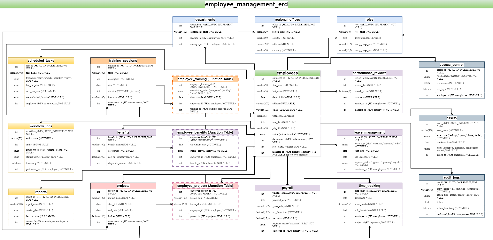

<div style="text-align: center;">
<h1 style="font-weight: bold;">Employee Data Management</h1>
</div>

## **Introduction**
This project is designed to manage and store employee data for an organization. It allows for the tracking of employee information, including personal details, departments, roles, payroll, attendance, training, benefits, and project assignments. Additionally, the system handles asset management, workflow tracking, and audit logging for enhanced accountability.

The system is intended to showcase skills in database design, data management, and system development. It demonstrates the ability to create a robust relational database schema using MySQL, including defining entities, relationships, and managing employee-related data.

---

## **Features**
- Employee management (personal details, department, role, payroll, attendance)
- Department and regional office tracking
- Role and training management
- Payroll and leave tracking
- Asset and benefits management
- Project assignment and tracking
- Time tracking and leave management
- Scheduled task management
- Workflow logs for task progress and system process improvement
- Audit logs for system actions
- Comprehensive reporting for employee and organizational insights
- Regional office support and hierarchical structuring

---

## **Getting Started**

These instructions will help you set up the project locally for development and testing purposes.

### **Prerequisites**
- MySQL 8.0 or higher
- Git
- [MySQL Workbench](https://dev.mysql.com/downloads/workbench/) (optional but recommended for schema design)

### **Installation**
1. **Clone the Repository**:
   ```bash
   git clone https://github.com/your-username/employee-data-management.git
   ```

2. **Navigate into the Project Folder**:
   ```bash
   cd employee-data-management
   ```

3. **Set Up Your MySQL Database**:
   - Create a new MySQL database (you can name it `employee_management`):
     ```sql
     CREATE DATABASE employee_management;
     ```
   - Import the initial database schema:
     ```bash
     mysql -u root -p employee_management < schema.sql
     ```

4. (Optional) Set up MySQL Workbench to visually manage the database schema.

---

## **Database Design**

The database is designed to store detailed information about employees, departments, roles, payroll, projects, training, benefits, assets, workflows, time tracking, and audit logging.

### **ERD (Entity Relationship Diagram)**


---

### **Entities and Relationships**

Below is a detailed list of all **20 tables**, logically grouped by functionality:

#### **Core Entities**
- **Employees**: Stores personal and professional employee data. Core entity linked to all other major functionalities.
- **Departments**: Tracks organizational departments and their locations.
- **Roles**: Stores job roles and salary ranges for employees.
- **Regional Offices**: Tracks physical office locations globally.

#### **Payroll and Benefits**
- **Payroll**: Tracks salary payments and deductions for employees.
- **Benefits**: Lists employee benefit programs.
- **Employee Benefits (Junction Table)**: Links employees to their enrolled benefits.

#### **Training and Performance**
- **Training Sessions**: Tracks training programs conducted by the organization.
- **Employee Training (Junction Table)**: Links employees to training sessions.
- **Performance Reviews**: Tracks employee performance evaluations.

#### **Projects and Tasks**
- **Projects**: Stores project details for organizational initiatives.
- **Employee Projects (Junction Table)**: Links employees to projects.
- **Scheduled Tasks**: Tracks recurring or one-time organizational tasks.
- **Workflow Logs**: Tracks task progress and updates.

#### **Time and Leave Management**
- **Time Tracking**: Logs work hours, breaks, and overtime for employees.
- **Leave Management**: Tracks employee leave requests and approvals.

#### **Assets and System Management**
- **Assets**: Tracks organizational assets assigned to employees.
- **Access Control**: Manages system roles and permissions for employees.
- **Audit Logs**: Records system actions for accountability.

#### **Reporting and Logs**
- **Reports**: Tracks reports generated for organizational data insights.
- **Audit Logs**: Tracks system changes and actions for security purposes.

---

### **Key Relationships**

- **Employees ↔ Departments**: One-to-Many
- **Employees ↔ Roles**: One-to-Many
- **Employees ↔ Payroll**: One-to-Many
- **Employees ↔ Benefits**: Many-to-Many
- **Employees ↔ Projects**: Many-to-Many
- **Employees ↔ Time Tracking**: One-to-Many
- **Departments ↔ Projects**: One-to-Many
- **Scheduled Tasks ↔ Workflow Logs**: One-to-Many
- **Workflow Logs ↔ Audit Logs**: One-to-Many

---

## **Development**

### **Employee Table Implementation**
The **Employees** table includes the following columns:
- `employeeID`, `firstName`, `lastName`, `email`, `phone`, `hireDate`, `departmentID`, `roleID`, `managerID`, `status`, `address`.

### **Reporting**
The system enables the generation of comprehensive reports, using SQL JOIN queries across multiple tables, including but not limited to:
- Employee attendance
- Payroll summaries
- Department performance

---

### **Next Steps**
1. Complete data entry scripts for all 20 tables.
2. Test CRUD (Create, Read, Update, Delete) operations.
3. Design SQL queries for reports combining data across tables.
4. Validate relationships and indexing to optimize performance.

---

## **Contributing**

1. **Fork the Repository**:
   ```bash
   git clone https://github.com/your-username/employee-data-management.git
   ```

2. **Create Your Feature Branch**:
   ```bash
   git checkout -b feature-name
   ```

3. **Commit Your Changes**:
   ```bash
   git commit -am "Add new feature"
   ```

4. **Push to the Branch**:
   ```bash
   git push origin feature-name
   ```

5. **Create a New Pull Request** via GitHub.

---

## **License**

This project is licensed under the MIT License - see the [LICENSE](LICENSE) file for details.

---